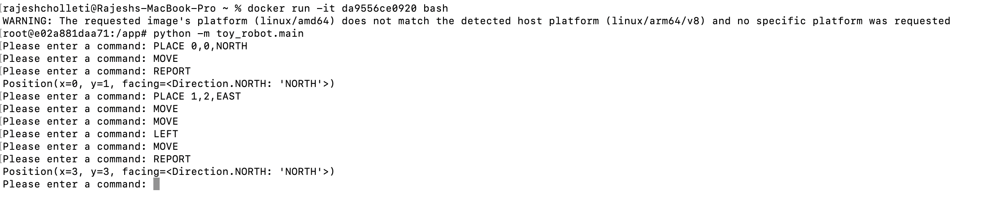

# Toy Robot Challenge

[](https://github.com/Rajeshsupreet/toy-robot-challenge/actions/workflows/actions.yml)

## Description

- The application is a simulation of a toy robot moving on a square tabletop, of dimensions 5 units x 5 units
- There are no other obstructions on the table surface
- The robot is free to roam around the surface of the table, but must be prevented from falling to destruction
- Any movement that would result in the robot falling from the table must be prevented, however further valid movement
  commands must still be allowed

Create an application that can read in commands of the following form -

    PLACE X,Y,F
    MOVE
    LEFT
    RIGHT
    REPORT

PLACE will put the toy robot on the table in position X,Y and facing NORTH, SOUTH, EAST or WEST.

The origin (0,0) can be considered to be the SOUTH WEST most corner.

The first valid command to the robot is a PLACE command, after that, any sequence of commands may be issued, in any
order, including another PLACE command. The application should discard all commands in the sequence until a valid PLACE
command has been executed.

MOVE will move the toy robot one unit forward in the direction it is currently facing.

LEFT and RIGHT will rotate the robot 90 degrees in the specified direction without changing the position of the robot.

REPORT will announce the X,Y and F of the robot. This can be in any form, but standard output is sufficient.

A robot that is not on the table can choose the ignore the MOVE, LEFT, RIGHT and REPORT commands.

Input can be from a file, or from standard input, as the developer chooses.

Provide test data to exercise the application.

## Constraints

The toy robot must not fall off the table during movement. This also includes the initial placement of the toy robot.
Any move that would cause the robot to fall must be ignored.

## Example Test cases

    a) PLACE 0,0,NORTH
       MOVE
       REPORT
       Output: 0,1,NORTH

    b) PLACE 0,0,NORTH
       LEFT
       REPORT
       Output: 0,0,WEST

    c) PLACE 1,2,EAST
       MOVE
       MOVE
       LEFT
       MOVE
       REPORT
       Output: 3,3,NORTH

##  Deployment
### GitHub Actions 
- Whenever new code is merged to the main branch then the GitHub action will be triggered automatically.
- On successful build completion, new tag version of docker images is pushed
- The secret variables are configured in Github
- Full workflow about docker build is available in the [actions.yml](.github/workflows/actions.yml)


## Run the app

Start docker and Open terminal in local computer

```sh
rajeshcholleti@Rajeshs-MacBook-Pro ~ % 
```

Pull the docker image to local

```sh
docker pull rajeshsupreet/toy-robot
```
once image is successfully pulled, follow below commands to run the app

```sh
docker run -it docker run -it da9556ce0920 bash
```
where "da9556ce0920" is image tag

run python code

```sh
python -m toy_robot.main
```

Below is example of successful test cases



`Ctrl-C` to exit it and type exit to get out from docker image.